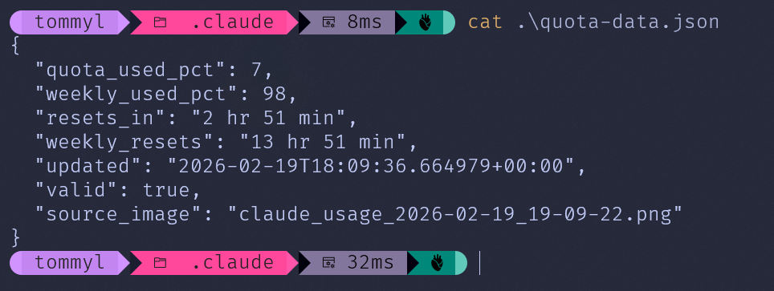

# SUPERSEDED BY SIMPLER VERSION

- https://github.com/aweussom/claude-code-quota  

This code will stay online, because it documents a very simple way to get full screen screenshots, and use a (free) LLM to decode information from it.

# claude-quota-scraper

Monitor your Claude.ai usage quota by capturing screenshots and extracting structured data with an Ollama vision model.

## What It Does

Claude.ai shows your usage limits on a settings page, but there's no API to query them programmatically. This project works around that:

1. **`capture_claude_usage.ps1`** - A PowerShell script that takes a screenshot of your screen every N seconds (default: 60). You navigate to the Claude usage page and let it run.
2. **`parse_quota.py`** - A single Python script with two modes: `parse` (one-shot parse for one screenshot) and `monitor` (long-running mode that watches screenshots and updates `~/.claude/quota-data.json` for Claude Code status line usage).
3. **`statusline.ps1`** - A PowerShell status line script that combines Claude Code's built-in context window percentage with your scraped quota percentage.

### Why a screenshot instead of a code block?

Because the whole point is that it looks good. The JSON output is rendered in Windows 11 PowerShell with oh-my-posh and a properly installed Nerd Font, which took an embarrassingly non-trivial amount of effort to set up for someone who has spent 40 years avoiding Windows terminals on principle. A code block would just show you text; the screenshot is proof of non-suckiness.



## Output: Claude Code Quota File (`~/.claude/quota-data.json`)

```json
cat .\quota-data.json
{
  "quota_used_pct": 10,
  "weekly_used_pct": 99,
  "resets_in": "2 hr 38 min",
  "weekly_resets": "13 hr 38 min",
  "updated": "2026-02-19T18:24:37.351014+00:00",
  "valid": true,
  "source_image": "claude_usage_2026-02-19_19-24-25.png"
}
```

## Requirements

- **Windows** (the screenshot capture uses .NET `System.Windows.Forms`)
- **Python 3.10+** (no third-party dependencies, uses only stdlib)
- **Ollama endpoint** (cloud or local)
- **Ollama Cloud API key** if using `https://ollama.com` (set `OLLAMA_API_KEY`)

## Security / Privacy Warning

`capture_claude_usage.ps1` captures your full primary screen. `parse_quota.py` then uploads that image to the configured Ollama host.

If you use Ollama Cloud (`https://ollama.com`), your screenshot leaves your machine. If you are at all security-sensitive, run a local vision model instead.

Local models that have worked well:
- `qwen3-vl:8b`
- `gemma3:4b` (likely good enough for this task)

## Usage

### 1. Capture Screenshots (Standalone)

Open the Claude.ai usage/settings page in your browser, then run:

```powershell
.\capture_claude_usage.ps1
```

Optional parameters:

```powershell
.\capture_claude_usage.ps1 -IntervalSeconds 30 -OutputDir "C:\my\screenshots"
```

If PowerShell refuses to run the script with a "not digitally signed" error, it may be blocked with a Mark-of-the-Web `Zone.Identifier` stream. Check and unblock it:

```powershell
Get-Item .\capture_claude_usage.ps1 -Stream Zone.Identifier -ErrorAction SilentlyContinue
Unblock-File .\capture_claude_usage.ps1
```

Note: screenshot capture is most reliable on a single-monitor setup. With mixed monitor resolutions/DPI scaling (and browser zoom), Windows can report scaled screen bounds and the capture may be clipped (often on the right side). If this happens, temporarily disable the secondary monitor(s) or set all displays to the same scaling while capturing. Then get to work fixing this mess.

Press `Ctrl+C` to stop.

### 2. Parse a Screenshot (One-Shot)

Ollama CLoud has a free tier (for now)** — Ollama Cloud gives you access to massive models without paying per token (still requires an API key, and "free" is famously a temporary condition on the internet)

Cloud example:

```bash
export OLLAMA_API_KEY="your-key-here"
python parse_quota.py parse claude_usage_2026-01-16_01-15-51.png
```

Local Ollama example (recommended if concerned about screenshot privacy):

```bash
python parse_quota.py parse claude_usage_2026-01-16_01-15-51.png \
  --host http://localhost:11434 \
  --model qwen3-vl:8b
```

`parse_quota.py parse` options:

| Flag | Default | Description |
|------|---------|-------------|
| `--model` | `qwen3-vl:235b-cloud` | Ollama vision model |
| `--host` | `https://ollama.com` | Ollama API endpoint |
| `-o FILE` | stdout | Write JSON to a file |
| `--timeout` | `120` | API timeout in seconds |
| `--debug` | off | Print raw LLM response |

### 3. Run Continuous Monitor for Claude Code

Local model (recommended if security-sensitive):

```bash
python parse_quota.py monitor \
  --watch-dir "C:/path/to/screenshots" \
  --host http://localhost:11434 \
  --model qwen3-vl:8b \
  --poll-seconds 10
```

Cloud model:

```bash
export OLLAMA_API_KEY="your-key-here"
python parse_quota.py monitor --watch-dir "C:/path/to/screenshots"
```

Start screenshot capture + monitoring in one command:

```bash
python parse_quota.py monitor \
  --start-capture \
  --watch-dir "C:/path/to/screenshots" \
  --capture-interval 60 \
  --host http://localhost:11434 \
  --model qwen3-vl:8b
```

This continuously updates:
- `~/.claude/quota-data.json` (compact payload for status line)
- optional full parse output via `--full-output path/to/file.json`

Screenshot retention: `monitor` treats screenshots as disposable and will delete files matching `--pattern` in `--watch-dir` (so point it at a dedicated folder). If parsing succeeds, the screenshot is deleted. If parsing fails, it keeps only the first and most recent failing screenshot (and deletes the rest), so the directory stays bounded.

### 4. Configure Claude Code Status Line

Copy `statusline.ps1` to:

```text
%USERPROFILE%\.claude\statusline.ps1
```

Then set `%USERPROFILE%\.claude\settings.json`:

```json
{
  "statusLine": {
    "type": "command",
    "command": "powershell -NoProfile -File C:/Users/YOUR_NAME/.claude/statusline.ps1"
  }
}
```

The status line output format is:

```text
ctx:<context_window.used_percentage>% quota:<quota_used_pct>%
```

### 5. Batch Processing (Optional)

Process all screenshots in a directory:

```bash
for img in claude_usage_*.png; do
  python parse_quota.py parse "$img" -o "${img%.png}.json"
done
```

## How It Works

`parse_quota.py`:
1. Base64-encodes the screenshot
2. Sends it to the Ollama vision API with a structured extraction prompt
3. Parses JSON from the model response (handles code blocks, thinking tags, trailing commas)
4. Validates that percentages are in the 0-100 range
5. Returns a consistent schema even on failure (nulls instead of crashes)

`parse_quota.py monitor`:
1. Watches your screenshot directory for new files
2. Parses the newest screenshot
3. Writes `~/.claude/quota-data.json` atomically for Claude Code
4. Deletes successful screenshots and prunes failures (keeps first + most recent failure only)
5. Repeats on a polling interval

## A less stupid option is: skip screenshots entirely (Claude Code + Chrome)

This repo exists because Claude.ai doesn't expose a quota API, and screenshot+OCR is a hack.

A cleaner approach would be to use Claude Code's Chrome integration to open `https://claude.ai/settings/usage` in your already-logged-in browser session and extract the quota values directly from the page (no screenshots, no DPI issues).

Notes / limitations:
- Chrome integration is **not supported in WSL**, so this would need to run from Claude Code on Windows (not `claude` inside WSL).
- Requires Chrome/Edge + the "Claude in Chrome" extension + Claude Code (and a direct Anthropic plan).

Example idea (PowerShell, on Windows):

```powershell
$schema = '{"type":"object","properties":{"current_session":{"type":"object","properties":{"percent_used":{"type":"number"},"resets_in":{"type":"string"}},"required":["percent_used","resets_in"]},"weekly_limits":{"type":"object","properties":{"percent_used":{"type":"number"},"resets":{"type":"string"}},"required":["percent_used","resets"]}},"required":["current_session","weekly_limits"]}'
$prompt = 'Open https://claude.ai/settings/usage and extract: current session percent used + resets_in, and weekly limits percent used + resets. Return only JSON.'
claude -p --chrome --output-format json --json-schema $schema $prompt
```

## License

MIT


