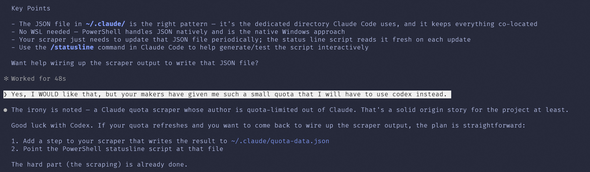

## The Problem Nobody Asked Me to Solve

If you use Claude Pro (or Max, or Team), you've probably experienced the ritual: you're deep in a coding session, Claude is on fire, and then — rate limited. The dreaded "you've hit your usage limit" message appears. You stare at the usage bar in settings. *Was that 60%? 65%? How long until reset?*

Anthropic shows you this information on a nice little settings page. But there's no API for it. No webhook. No "hey, you're at 80%" notification. Just a page with bars and text that you have to manually go look at.

So naturally, I did what any reasonable developer would do: I built a pipeline that screenshots my screen every minute and feeds it to a 235-billion-parameter vision model to read the numbers for me.

## The Architecture (If You Can Call It That)

The system has three moving parts:

**Part 1: A PowerShell script that mashes the Print Screen button**

```powershell
.\capture_claude_usage.ps1
```

That's it. It takes a full screenshot every 60 seconds and saves it as a timestamped PNG. You open the Claude usage page, run the script, and walk away. It uses `System.Windows.Forms` to grab the screen — no dependencies, no installs, just raw .NET energy.

If PowerShell refuses to run it with a "not digitally signed" error, the file is probably blocked (Mark-of-the-Web). Check and unblock it:

```powershell
Get-Item .\capture_claude_usage.ps1 -Stream Zone.Identifier -ErrorAction SilentlyContinue
Unblock-File .\capture_claude_usage.ps1
```

Also: this capture approach is most reliable on a single-monitor setup. Mixed resolutions + mixed DPI scaling (and browser zoom) can cause clipped captures.

**Part 2: A Python script that asks an AI to read a screenshot of an AI's usage page**

```bash
python parse_quota.py parse claude_usage_2026-01-16_01-15-51.png
```

By default this uses Ollama Cloud (Qwen3-VL 235B) and asks it to extract the quota numbers. You can also point it at a local Ollama host if you don't want screenshots leaving your machine. The response comes back as structured JSON:

```json
{
  "captured_at": "2026-01-16T01:15:00+00:00",
  "current_session": {
    "percent_used": 42,
    "resets_in": "3 hr 53 min"
  },
  "weekly_limits": {
    "percent_used": 18,
    "resets": "Thu 10:59 AM"
  }
}
```

And because I'm incapable of leaving well enough alone, here's the same output as a screenshot:


### Why a screenshot instead of a code block?

Because the whole point is that it looks good. The JSON output is rendered in Windows 11 PowerShell with oh-my-posh and a properly installed Nerd Font — which took an embarrassingly non-trivial amount of effort to set up for someone who has spent 40 years avoiding Windows terminals on principle.

A code block would just show you text. The screenshot shows you that yes, a middle-aged Norwegian with a Linux soul can make PowerShell look like that. Consider it proof of non-suckiness.

Yes, I'm using an AI to monitor an AI. The irony is not lost on me.

**Part 3: A monitor loop that feeds Claude Code's status line**

`parse_quota.py monitor` watches a screenshot directory and writes `~/.claude/quota-data.json` atomically. Pair it with `statusline.ps1` and you can display `ctx:<...>% quota:<...>%` in Claude Code while you work.

Bonus: it cleans up after itself. If a screenshot parses correctly, it gets deleted. If parsing fails, it keeps only the first and the most recent failing screenshot (and deletes the rest) so your screenshot folder doesn't quietly evolve into a 4K documentary about your browser tabs. Please do not point `--watch-dir` at your Photos folder unless you're emotionally prepared for consequences.

## Why Ollama Cloud + Qwen3-VL?

A few reasons:

1. **It's free** — Ollama Cloud gives you access to massive models without paying per token
2. **Qwen3-VL 235B is genuinely good at reading text in images** — it nails the percentage values and reset times consistently
3. **Zero Python dependencies** — the entire script uses only stdlib (`urllib`, `json`, `base64`, `argparse`). No `requests`, no `pillow`, no `openai` SDK. Just raw `urllib.request` like our ancestors intended

## The Interesting Parts

### Robust JSON Extraction

LLMs are... creative with their output formatting. Sometimes you get clean JSON. Sometimes you get JSON wrapped in markdown code blocks. Sometimes you get a `<think>` tag with the model's internal monologue followed by JSON with trailing commas.

The `extract_json_from_response` function handles all of this:

```python
# Strip thinking tags first
text = strip_thinking_tags(text)

# Try code blocks: ```json { ... } ```
# Try brace matching: find first { and its matching }
# Try cleaning: remove trailing commas
# Last resort: parse the whole thing
```

It's the kind of defensive parsing you write after the third time your pipeline breaks at 2 AM.

### Fail-Safe Output

The script never crashes on bad data. If the vision model hallucinates, if the JSON is garbage, if the image is blank — you still get a valid response structure with `null` values. The exit code tells you something went wrong, but downstream consumers always get parseable JSON.

```python
def empty_quota_response() -> dict:
    return {
        "captured_at": datetime.now(timezone.utc).isoformat(),
        "current_session": {"percent_used": None, "resets_in": ""},
        "weekly_limits": {"percent_used": None, "resets": ""},
    }
```

### Zero Temperature

The Ollama API call uses `temperature: 0.0` because we want deterministic extraction, not creative writing. When you're reading numbers off a screen, you want the model to be as boring as possible.

## How to Use It

**Prerequisites:**
- Windows (for the screenshot script)
- Python 3.10+
- An Ollama endpoint (cloud or local)
- `OLLAMA_API_KEY` if you're using a non-local host (like `https://ollama.com`)

**Steps:**

1. Clone the repo:
```bash
git clone https://github.com/aweussom/claude-quota-scraper.git
cd claude-quota-scraper
```

2. If you're using Ollama Cloud, set your API key:
```bash
export OLLAMA_API_KEY="your-key-here"
```

3. Open Claude.ai settings/usage page in your browser

4. Start capturing:
```powershell
.\capture_claude_usage.ps1
```

5. Parse any screenshot (cloud):
```bash
python parse_quota.py parse claude_usage_2026-01-16_01-15-51.png
```

Local Ollama example (recommended if you're privacy-paranoid):

```bash
python parse_quota.py parse claude_usage_2026-01-16_01-15-51.png \
  --host http://localhost:11434 \
  --model qwen3-vl:8b
```

6. Run a continuous monitor loop (updates `~/.claude/quota-data.json`):

```bash
python parse_quota.py monitor --watch-dir "C:/path/to/screenshots"
```

If you want it to start screenshot capture automatically:

```bash
python parse_quota.py monitor \
  --start-capture \
  --watch-dir "C:/path/to/screenshots" \
  --capture-interval 60
```

7. Batch process everything:
```bash
for img in claude_usage_*.png; do
  python parse_quota.py parse "$img" -o "${img%.png}.json"
done
```

## A less stupid option is: skip screenshots entirely (Claude Code + Chrome)

Claude Code can integrate with a Chrome/Edge extension and extract data directly from web pages (using your existing logged-in browser session). In theory, that could open `https://claude.ai/settings/usage` and read the quota values with zero screenshots and zero OCR.

The catch: Chrome integration is not supported in WSL, so you'd run this from Claude Code on Windows. Which is so perfectly on-brand that I screenshotted the docs:



## What's Next?

This is a scrappy v1. Some ideas for making it less ridiculous:

- **Crop the screenshot** to just the usage area instead of sending the full screen (faster, cheaper, more accurate)
- **Add a scheduler** that runs the full pipeline end-to-end and logs to a CSV/SQLite database
- **Build a dashboard** to visualize usage over time
- **Cross-platform capture** using Python instead of PowerShell
- **Alert thresholds** — get a notification when you're approaching your limit
- **Claude Code + Chrome mode** — read the numbers from the DOM instead of doing screenshot OCR

Or, you know, Anthropic could just give us an API endpoint for this. Just putting that out there.

## The Repo



The whole thing is a single stdlib Python script plus two small PowerShell scripts, zero external dependencies, and MIT licensed. Star it if you too have been personally victimized by Claude rate limits.

---

*Built with frustration and a vision model that's probably using more compute to read my quota than I'm using on the quota itself.*
